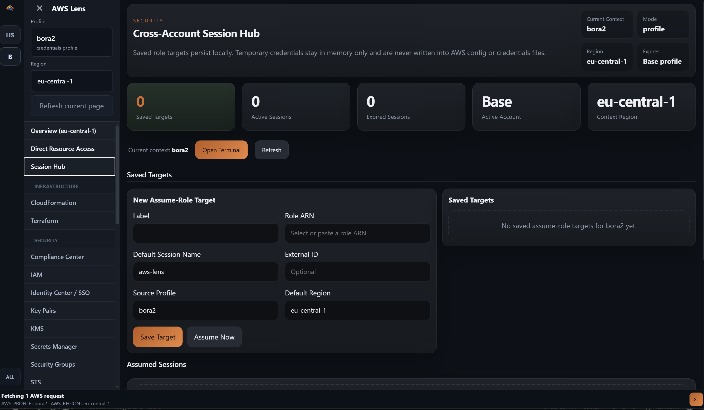
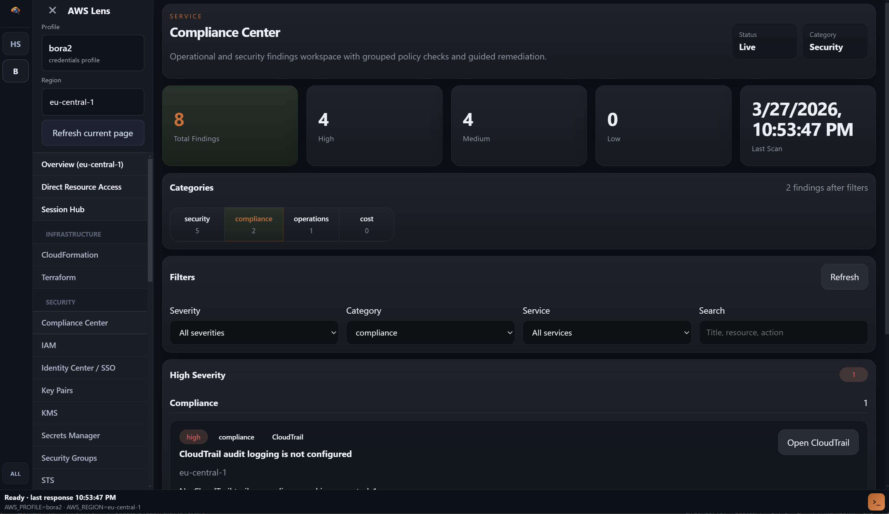
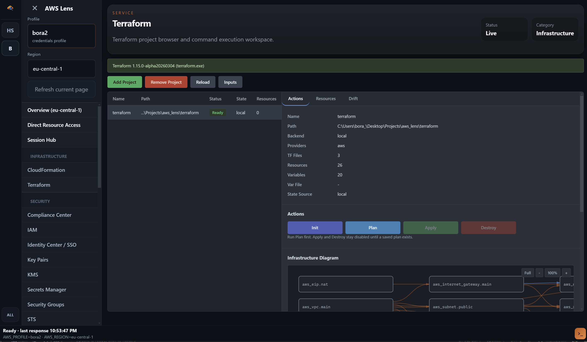
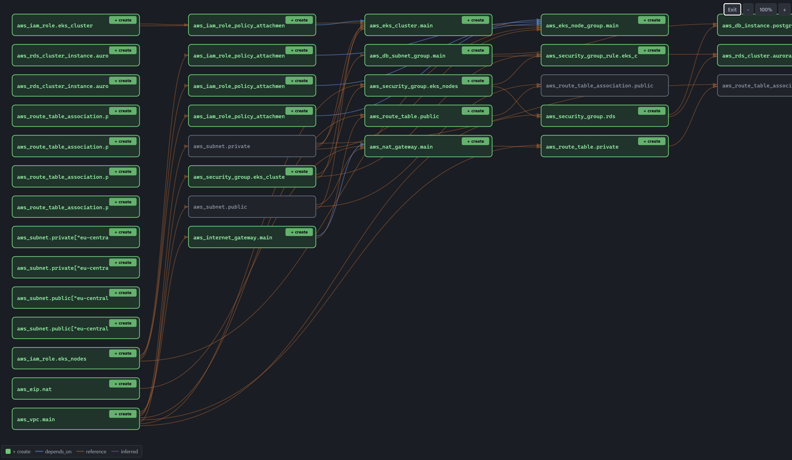

<div align="center">

# AWS Lens

A desktop AWS operator workspace built on Electron, React, and TypeScript. AWS Lens combines a profile-aware navigation shell, service-specific operational consoles, Terraform infrastructure management, governance checks, session switching, direct resource access, and an embedded terminal in one desktop UI.

[](./LICENSE)
[](https://www.electronjs.org/)
[](https://react.dev/)
[](https://www.typescriptlang.org/)
[](https://docs.aws.amazon.com/AWSJavaScriptSDK/v3/latest/)
[](https://nodejs.org/)
[](https://pnpm.io/)


</div>

---

## Interface Tour

The current UI is organized around a left-rail workspace shell instead of a single-service dashboard. Operators select a profile and region once, then move across overview, Terraform, direct resource access, session workflows, and service-specific consoles without losing context.

### Shared Shell

- Left sidebar with profile and region context, pinned services, grouped AWS workspaces, and utility screens
- Persistent footer terminal toggle backed by `node-pty` and synchronized with the active AWS session
- Refresh actions keep the current selection and screen context instead of forcing a full navigation reset
- Screen-specific hero panels surface posture, cost, inventory, and next actions up front

### Overview Workspace


The overview screen is the new landing surface. It combines regional posture, top services, cost posture, relationship counts, insights, and quick routing into deeper consoles from the same shell.

### EC2 Workspace


The EC2 console now uses an operator-focused split layout: fleet summary cards on top, instance/volume/snapshot tabs in the center, and action-heavy detail panels for start/stop, resize, snapshots, bastion access, CloudWatch jumps, and SSM-driven workflows.

### S3 Workspace


The S3 console pairs object browsing with governance posture. Buckets, prefixes, preview/edit flows, lifecycle gaps, encryption/versioning state, and remediation-oriented governance actions live in the same workspace.

### Session and Compliance Workspaces





Session Hub handles assume-role targets and temporary sessions, while Compliance Center acts as an operational queue for findings, severity rollups, filters, and guided remediation.

### Terraform Workspace



Terraform remains a first-class part of the application, but it now sits inside the same navigation shell as the AWS service consoles instead of feeling like a separate mode.

---

## Terraform as a First-Class Service

AWS Lens treats Terraform as a core operator workflow, not an afterthought. The Terraform workspace provides a full lifecycle management surface: from project discovery and variable configuration through plan visualization, apply execution, drift reconciliation, and governance enforcement.

### Project Discovery and Command Execution

- Discover and manage local Terraform project folders from a visual project browser
- Run `init`, `plan`, `apply`, `destroy`, `import`, `state`, `force-unlock`, and `version` with real-time streaming output
- Create, switch, and delete Terraform workspaces
- Track long-running apply/destroy operations, including graceful handling during app shutdown
- Git metadata integration showing repository, branch, commit, dirty status, and changed files per project

### Variable Sets and Secret Inputs

- Create named variable sets with a base layer plus environment-specific overlays
- Edit variables inline with validation, sensitive value masking, and type-aware inputs
- Pull runtime secrets from AWS Secrets Manager and SSM Parameter Store directly into variable configuration
- Load variables from `.tfvars` files or JSON configuration
- Detect missing required variables before plan or apply

### Plan Visualization and Analysis

- Generate plans with multiple execution modes: standard, refresh-only, targeted, and replace
- Save and compare plan artifacts with grouped change summaries by module, action type, and resource
- Heuristic detection of destructive changes, replacements, and delete-heavy operations
- Visual plan diff with create, update, and delete indicators

### Drift Reconciliation

Drift detection compares Terraform state against live AWS resources across a wide range of resource types:

- **Compute**: EC2 instances, Lambda functions, EKS clusters, ECS (via Terraform state)
- **Networking**: VPCs, subnets, security groups, route tables, internet gateways, NAT gateways, transit gateways, network interfaces
- **Storage**: S3 buckets, ECR repositories
- **Database**: RDS instances and clusters

Each resource receives a status classification (`in_sync`, `drifted`, `missing_in_aws`, `unmanaged_in_aws`, `unsupported`) and an assessment level (`verified`, `inferred`, `unsupported`). Drift results include attribute-level diffs, tag drift, and heuristic findings. Snapshot history with trend tracking shows whether drift is improving or worsening over time.

From any drifted resource, shortcuts open the AWS Console or run `terraform state show` directly.

### Governance and Safety Checks

- Detects availability of `terraform validate`, `tflint`, `tfsec`, and `checkov`
- Runs governance tools with configurable requirements (blocking vs. optional)
- Categorizes findings by severity: critical, high, medium, low, info
- Produces governance reports with check status, findings, and execution times
- Pre-apply blocking prevents `terraform apply` when critical checks fail

### State Management and Backups

- View raw Terraform state JSON and parsed resource inventory
- Browse managed and data resources with type, address, attributes, and tags
- Automated state backups (up to 20 per workspace) with size tracking
- State lock visibility showing lock ID, who holds it, and lock operation
- State operations history for audit and troubleshooting

### Infrastructure Diagram



Visual graph of Terraform-managed resources and their dependency relationships, generated from the current state.

### Run History

- Timestamped records of every Terraform command executed
- Command arguments (with redacted sensitive values), exit codes, and duration
- Filterable history with bulk cleanup

---

## AWS Operator Workspace

Beyond Terraform, AWS Lens provides a full operator workspace for common AWS services. It reads local AWS profiles, lets you activate a profile and region, and keeps that context synchronized across the UI and the embedded terminal.

### Profile and Region Context

- Reads AWS profiles from `~/.aws/config` and `~/.aws/credentials`
- Searchable profile catalog with import and creation support
- Create app-managed credential profiles directly from the desktop UI
- App-managed credentials are stored in an encrypted local vault under Electron `userData`, not written back to `~/.aws/credentials`
- Pin frequently used services in the sidebar for faster switching
- Region-aware service navigation with context kept in sync across all screens
- Refresh the active screen without losing the selected account or region context
- Keeps utility screens such as `Overview`, `Direct Resource Access`, and `Session Hub` pinned near the top of the workspace shell

### Overview Dashboard

The Overview screen is the landing surface for day-to-day AWS navigation. It gives operators a regional snapshot first, then lets them fan out into deeper service consoles and relationship views.

- Regional overview tiles for EC2, Lambda, EKS, Auto Scaling, S3, RDS, CloudFormation, ECR, ECS, VPC, Load Balancers, Route 53, Security Groups, SNS, SQS, ACM, KMS, WAF, Secrets Manager, Key Pairs, CloudWatch, CloudTrail, and IAM
- Optional global overview across multiple regions with service totals and region breakdowns
- Cost visibility using Cost Explorer when available, with heuristic fallback when it is not
- Relationship mapping between resources with filterable edge lists and drill-down navigation
- Statistics and insight panels grouped by compute, storage, networking, security, management, and messaging
- Search-by-tag workflow that returns matching resources and a cost-oriented rollup

Overview doubles as a routing surface: clicking most tiles opens the corresponding service workspace with the current AWS context already applied.

The current renderer implements tabbed overview modes for `Overview (Region)`, `Resource Relationship View`, `Statistics`, and `Search By Tag`, matching the navigation visible in the new UI.

### Session Hub

Cross-account session management for assume-role workflows:

- Save assume-role targets locally
- Assume roles through STS on demand with session tracking
- Activate assumed sessions as the active app context
- Temporary credentials held in memory only, never written to AWS config files
- Saved assume-role targets are persisted under Electron `userData` using encrypted local storage


The Session Hub is more than a credential switcher. It keeps a local catalog of role targets, tracks active and expired sessions, shows expiration countdowns, and lets you jump into the embedded terminal or diff mode using the assumed-role context. This makes cross-account workflows practical without rewriting local AWS config files or copying short-lived credentials around by hand.

### Compare Workspace

AWS Lens includes a dedicated compare mode for side-by-side inspection of two AWS contexts. Each side can be a base profile or an active assumed-role session, and each side can target a different region.

- Compare inventory, posture, ownership tags, cost signals, and operational risk
- Filter results by focus area: security, compute, networking, storage, drift/compliance, and cost
- Switch between grouped and flat diff tables
- Open the relevant service console directly from a selected diff row
- Use Session Hub as a launch point for cross-account comparisons

### Compliance Center

Aggregates security findings for the active profile and region, grouped by severity and category with guided remediation paths.


In practice, the Compliance Center acts as an operations queue:

- Summarizes total findings and the current high/medium/low distribution
- Organizes findings by category: security, compliance, operations, and cost
- Supports filtering by severity, category, service, and free-text search
- Surfaces collection warnings when AWS APIs do not return complete data
- Provides guided remediation actions, including navigation into the relevant service workspace, terminal-driven fixes, and Secrets Manager rotation actions

### Service Consoles

Dedicated consoles for 25+ AWS services with inventory views and targeted operator actions:

| Category | Services |
|---|---|
| Compute | EC2, Lambda, ECS, EKS, Auto Scaling |
| Storage | S3, ECR |
| Database | RDS |
| Networking | VPC, Load Balancers, Route 53, Security Groups |
| Management | CloudFormation, CloudTrail, CloudWatch |
| Security | IAM, Identity Center, KMS, WAF, ACM |
| Messaging | SNS, SQS |
| Other | Secrets Manager, Key Pairs, STS |

The service catalog is implemented as focused workspaces rather than generic wrappers around AWS APIs. Examples include:

- `EC2`: instance inventory, snapshots, IAM instance profiles, bastion-oriented actions, and links into CloudWatch
- `VPC` and `Security Groups`: network topology, gateways, interfaces, reachability context, and rule management
- `EKS` and `ECS`: cluster and service views with helper actions that connect into the embedded terminal
- `S3`, `ECR`, `Lambda`, and `RDS`: service-native detail views for common operator inspection flows
- `IAM`, `Identity Center`, `STS`, `KMS`, `WAF`, `ACM`, and `Secrets Manager`: identity, crypto, perimeter, certificate, and secret-management tasks in the same desktop shell
- `CloudFormation`, `CloudTrail`, `CloudWatch`, `Route 53`, `SNS`, and `SQS`: deployment, audit, telemetry, DNS, and messaging workflows without leaving the active AWS context

### Direct Resource Access

AWS Lens also includes a direct-access screen for situations where list permissions are restricted but targeted read access is still allowed.

- Open S3 buckets, Lambda functions, RDS instances or clusters, ECR repositories, ECS services, EKS clusters, CloudFormation stacks, Route 53 hosted zones, Secrets Manager secrets, SNS topics, SQS queues, KMS keys, WAF web ACLs, and ACM certificates directly by known identifier
- Return raw detail payloads in-place so operators can inspect a resource even when the account cannot enumerate the full service
- Useful for break-glass support flows and tightly scoped IAM policies

### Observability and Resilience Lab (Beta)

Operator-assistant surface for EKS clusters, ECS services, and Terraform workspaces. Provides posture analysis, telemetry gap detection, and resilience recommendations. Generates copyable artifacts: OTel YAML, awslogs snippets, Terraform snippets, and FIS template JSON.

### Embedded Terminal

- Backed by `node-pty` and `xterm`
- Shares active AWS context with the rest of the application
- Supports follow-up commands triggered from service screens
- Toggled from the footer as a persistent bottom panel

The terminal updates automatically when you change profiles, regions, or assumed-role sessions. Service workspaces can push follow-up commands into it, which makes the terminal a continuation of the GUI instead of a separate tool.

---

## Architecture

```text
.
|-- src/
|   |-- main/
|   |   |-- terraform.ts             # Terraform command orchestration
|   |   |-- terraformDrift.ts        # Drift detection against live AWS
|   |   |-- terraformGovernance.ts   # Governance tool runners
|   |   |-- terraformHistoryStore.ts # Run history persistence
|   |   |-- main.ts                  # Electron lifecycle, graceful shutdown
|   |   |-- awsIpc.ts               # AWS IPC handlers
|   |   |-- terminalIpc.ts          # PTY and terminal bridge
|   |   `-- aws/                    # 30+ AWS service client modules
|   |-- preload/
|   |   `-- index.ts                # Secure renderer-to-main bridge
|   `-- renderer/src/
|       |-- TerraformConsole.tsx     # Terraform UI workspace
|       |-- terraformApi.ts          # IPC bridge to Terraform backend
|       |-- terraform.css            # Terraform workspace styling
|       |-- App.tsx                  # App shell, navigation, routing
|       `-- *Console.tsx            # Service-specific consoles
|-- electron-builder.yml
|-- electron.vite.config.ts
|-- package.json
`-- tsconfig.json
```

### Local State

AWS Lens relies on your local workstation state rather than a hosted backend.

Reads from:
- `~/.aws/config`
- `~/.aws/credentials`

Also supports:
- App-managed credential profiles stored in an encrypted local vault under Electron `userData`

Stores app data under Electron `userData`:
- `local-vault.json` -- encrypted local vault for app-managed credentials and future local secrets
- `terraform-workspace-state.json` -- encrypted project list, workspace selections, and variable set metadata
- `terraform-state-backups/` -- automated state backup snapshots
- `session-hub.json` -- encrypted saved assume-role targets
- `profile-registry.json` -- encrypted registry of profiles managed by AWS Lens

Terraform artifacts stored per project:
- `.terraform-workspace.auto.tfvars.json` -- managed variable inputs
- `.terraform-workspace.tfplan` / `.tfplan.json` / `.tfplan.meta.json` -- plan artifacts
- `.terraform-workspace.state.json` -- cached state

### Security Model

- App-created long-lived AWS credentials are stored in an encrypted local vault backed by Electron `safeStorage`
- Imported AWS config and credentials files continue to work as standard shared-credentials sources
- Temporary assumed-role credentials remain memory-only and are not persisted to disk
- Session Hub state and Terraform workspace metadata stored under Electron `userData` are encrypted
- Destructive actions use a shared confirmation flow with contextual summaries, and selected high-impact deletes require typed confirmation

---

## Prerequisites

- Node.js 20+
- `pnpm`
- Local AWS credentials for the profiles you want to use
- Terraform CLI (required for Terraform workspace features)

Optional:
- `tflint`, `tfsec`, `checkov` for governance checks
- AWS CLI for terminal-based verification
- `kubectl` for EKS-related workflows
- `docker` for ECR-related workflows

## Development

```sh
pnpm install      # install dependencies
pnpm dev          # run in development mode
pnpm typecheck    # type-check the project
pnpm build        # build production bundles (output: out/)
pnpm preview      # preview the built app
```

## Packaging

```sh
pnpm dist          # create desktop packages
pnpm dist:win      # Windows (NSIS)
pnpm dist:mac      # macOS (DMG, ZIP)
pnpm dist:linux    # Linux (deb, AppImage)
```

Packaged artifacts are written to `release/`. `node-pty` is unpacked from ASAR for packaged builds.

## Notes for Contributors

- Renderer code should use the preload bridge rather than direct Node access
- AWS-facing actions live in the Electron main process
- App-managed credentials should go through the encrypted local vault, not direct writes to `~/.aws/credentials`
- Temporary assumed-role credentials are not persisted to AWS config files
- Session Hub state and Terraform workspace metadata stored under Electron `userData` are encrypted
- Terraform support is local-workspace oriented, not remote-service oriented
- The app blocks accidental shutdown while Terraform apply/destroy is active

Additional project guidance lives in [CONTRIBUTING.md](./CONTRIBUTING.md).

## License

MIT. See [LICENSE](./LICENSE).
